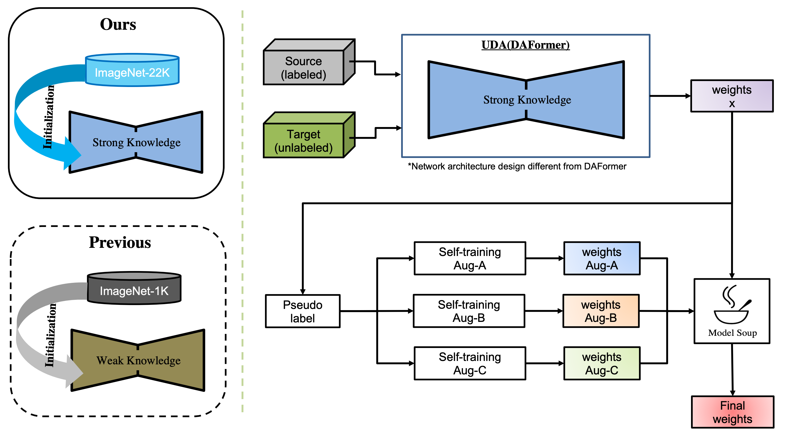

# VisDA2022_Winner_Solution

By Daehan Kim, Minseok Seo, Yongjin Jeon, Dong-Geol Choi

[VisDA2022 Challenge Website](https://ai.bu.edu/visda-2022/), [Tech Report](https://ai.bu.edu/visda-2022/)

<h3>:arrow_forward: Requirement</h3>

  Start with the DAFormer default settings.

  ```shell
  pip install -r additional_requirements.txt
  pip install mmcv-full==1.4.2
  ```
  
<h3>:arrow_forward: Prepare datasets (option-a)</h3>

  1. ZeroWaste V1: Please, download zerowaste-f.zip (7 G) from here and extract them to <code>data/zerowaste-f</code>.

  2. ZeroWaste V2: Please, download zerowaste-v2-trainval.zip (12 G) from here and extract it to <code>data/zerowaste-v2-splits/</code>.

  3. ZeroWaste V2: Please, download zerowaste-v2-test.zip (1.8 G) from here and extract it to <code>data/zerowaste-v2-splits/</code>.

  4. Merge ZeroWaste-f(train, val, test), zerowaste-v2-splits(train, val, test) and assign it zerowastev1, zerowastev2, respectively.
  
  
<h3>:arrow_forward: Prepare datasets (option-b) *recommended</h3>
  
  ```shell
    1. wget https://www.dropbox.com/s/ombq7do3sirbgcc/zerowastev1.zip?dl=0
    2. wget https://www.dropbox.com/s/a6jzs5530m63gmd/zerowastev2.zip?dl=0
    3. unzip zerowastev1.zip zerowastev2.zip #it is recommended to extract it from the following path: data/
  ```
  
If you have completed option-a or option-b, double-check the folder structure below.
  
```shell
<data>
|-- <zerowaste-f> #it is not shown in option-b.
    |-- <train>
    |-- <val>
    |-- <test>
    
|-- <zerowaste-v2-splits>
    |-- <train> #it is not shown in option-b.
    |-- <val> #it is not shown in option-b.
    |-- <test>
    
|-- <zerowastev1>
    |-- <data>
    |-- <sem_seg>
  
|-- <zerowastev2>
    |-- <data>
    |-- <sem_seg>

```
  
<h3> :arrow_forward: Hardware information </h3>

We uses the following hardware: RTX8000 x 1, RAM: 64 GB, GPU: 48 GB.

However, training only requires a maximum of less than 16 GB of GPU memory.

If the RAM capacity is low, only a small increase in training time is expected.

<h3> :arrow_forward: Download our checkpoints and pseudo-labels</h3>

The result of the leaderboard experiment is model soup.

|experiment|weights|logs|
|------|---|---|
|UDA|:arrow_down:<a href="https://www.dropbox.com/s/o9ahjk84jvit6lo/self_training_init.pth?dl=0" target="_blank">Download</a>|:arrow_down:<a href="https://www.dropbox.com/s/9h35xrg0gg8h3vu/20221001_183605.log.json?dl=0" target="_blank">Download</a>|
|Self-training Aug-A|:arrow_down:<a href="https://www.dropbox.com/s/ggssct6uupfmrxw/Aug_A.pth?dl=0" target="_blank">Download</a>|:arrow_down:<a href="https://www.dropbox.com/s/cnmnvgl4xphyktt/20221005_065551.log.json?dl=0" target="_blank">Download</a>|
|Self-training Aug-B|:arrow_down:<a href="https://www.dropbox.com/s/vtlggg222cwro1d/Aug_B.pth?dl=0" target="_blank">Download</a>|:arrow_down:<a href="https://www.dropbox.com/s/i7eejyyf0bksixs/20221005_065600.log.json?dl=0" target="_blank">Download</a>|
|Self-training Aug-C|:arrow_down:<a href="https://www.dropbox.com/s/ujtoe3ec9ci7p4h/Aug_C.pth?dl=0" target="_blank">Download</a>|:arrow_down:<a href="https://www.dropbox.com/s/62fuswmprk27bil/20221005_065609.log.json?dl=0" target="_blank">Download</a>|
|Model soup|:arrow_down:<a href="https://www.dropbox.com/s/8yodretu0mldybf/model_soup.pth?dl=0" target="_blank">Download</a>||
|Pseudo-Labels|:arrow_down:<a href="https://www.dropbox.com/s/faugl9zwicgavgm/Pseudo_Labels.zip?dl=0" target="_blank">Download</a> ||

or 

```shell
sh download_all.sh #logs are not downloaded.
```

<h3> :arrow_forward: Training</h3>



<h3>:point_right: Training from scratch</h3>
  
It takes about 20 hours on RTX8000 x 1. *(it depends on your hardware specs)

```shell
# [UDA training] 16 hours on RTX8000 x 1
python -m tools.train configs/_visda2022/_uda/uda.py --work-dir '/path/to/uda_exps'

# [Remove unnecessary parameters(e.g. ema, imnet, optimizer) for self-training]
python -m model_convert.py --load_weights '/path/to/uda_exps/checkpoint.pth' --save_weights '/path/to/self_training_init.pth'

# [Generate pseudo-labels for self-training]
python -m tools.test configs/_visda2022/zerowastev2_test.json '/path/to/self_training_init.pth' --eval mIoU --show-dir '/path/to/show_save_path' opacity 1.0 --pseudo_save_path '/path/to/pseudo_save_path'

# [Create a self-training dataset path using symbolic link]
ln -sf "$PWD/data/zerowaste-v2-splits/test/data" "$PWD/data/pseudo_labels/data"
ln -sf "$PWD/pseudo_save_path" "$PWD/data/pseudo_labels/sem_seg"

# [self-training aug-a, aug-b and aug-c] 1 hours on RTX8000 x 1, respectively.
python -m tools.train configs/_visda2022/_self_training/self_training_aug_a.json --work-dir '/path/to/self_training_aug_a_exps' --load-from '/path/to/self_training_init.pth'
python -m tools.train configs/_visda2022/_self_training/self_training_aug_b.json --work-dir '/path/to/self_training_aug_b_exps' --load-from '/path/to/self_training_init.pth'
python -m tools.train configs/_visda2022/_self_training/self_training_aug_c.json --work-dir '/path/to/self_training_aug_c_exps' --load-from '/path/to/self_training_init.pth'
  
# [model soup]
python -m tools.model_soup --save_weights '/path/to/model_soup.pth' --weights_init '/path/to/self_training_init.pth' --weights_a '/path/to/self_training_aug_a_exps/checkpoint.pth' --weights_b "/path/to/self_training_aug_b_exps/checkpoint.pth' --weights_c '/path/to/self_training_aug_c_exps/checkpoint.pth'

```
<h3>:point_right: Training from self-training (for quick reproducibility check) </h3>
  
 It takes about 3 hours on RTX8000 x 1. *(splitting it into 3 GPUs makes it run faster)
 
 
 <U>**_Download the <a href="https://www.dropbox.com/s/faugl9zwicgavgm/Pseudo_Labels.zip?dl=0" target="_blank">pseudo-labels</a>, <a href="https://www.dropbox.com/s/o9ahjk84jvit6lo/self_training_init.pth?dl=0" target="_blank">self_training_init_weights(UDA weights)</a> and set the dataset path before processing with the script below._**</U>
  
 ```shell
 
# [Create a self-training dataset path using symbolic link]
ln -sf "$PWD/data/zerowaste-v2-splits/test/data" "$PWD/data/pseudo_labels/data"
ln -sf "$PWD/pseudo_save_path" "$PWD/data/pseudo_labels/sem_seg"

# [self-training aug-a, aug-b and aug-c] 1 hours on RTX8000 x 1, respectively.
python -m tools.train '/path/to/self_training_aug_a.json' --work-dir '/path/to/self_training_aug_a_exps' --load-from '/path/to/self_training_init.pth'
python -m tools.train '/path/to/self_training_aug_b.json' --work-dir '/path/to/self_training_aug_b_exps' --load-from '/path/to/self_training_init.pth'
python -m tools.train '/path/to/self_training_aug_c.json' --work-dir '/path/to/self_training_aug_c_exps' --load-from '/path/to/self_training_init.pth'

# [model soup]
python -m tools.model_soup --save_weights '/path/to/model_soup.pth' --weights_init '/path/to/self_training_init.pth' --weights_a '/path/to/self_training_aug_a_exps/checkpoint.pth' --weights_b "/path/to/self_training_aug_b_exps/checkpoint.pth' --weights_c '/path/to/self_training_aug_c_exps/checkpoint.pth'
  ``` 
  
<h3>:arrow_forward: Evaluation</h3>
<h2></h2>

```shell
python -m tools.test /path/to/config/file /path/to/checkpoint.pth --eval mIoU --show-dir /path/to/output/predictions --opacity 1
```

<h3>:arrow_forward: Acknowledgements</h3>

  This project is based on the following open-source projects. We thank their authors for making the source code publically available.
  * [MMSegmentation](https://github.com/open-mmlab/mmsegmentation)
  * [SegFormer](https://github.com/NVlabs/SegFormer)
  * [DACS](https://github.com/vikolss/DACS)
